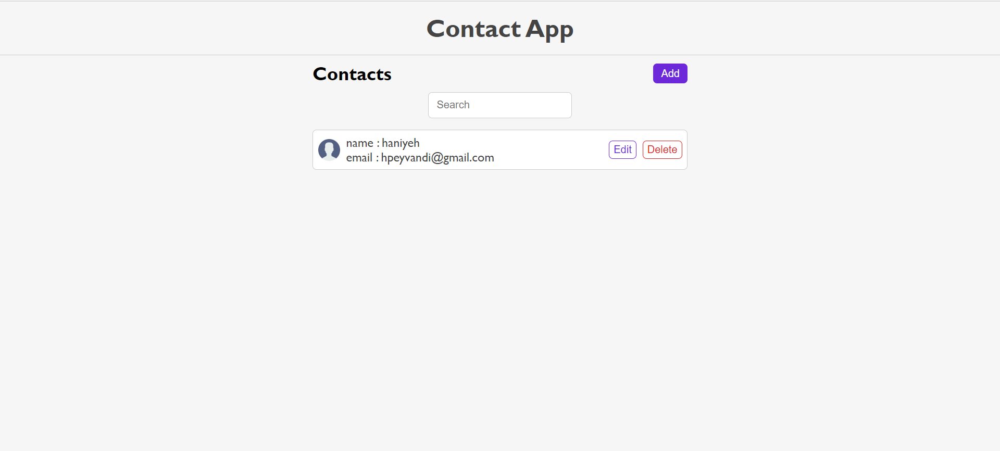
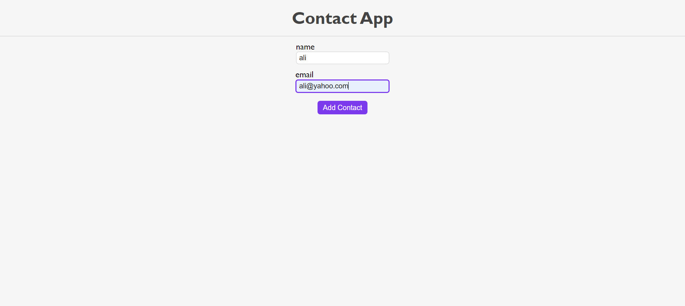
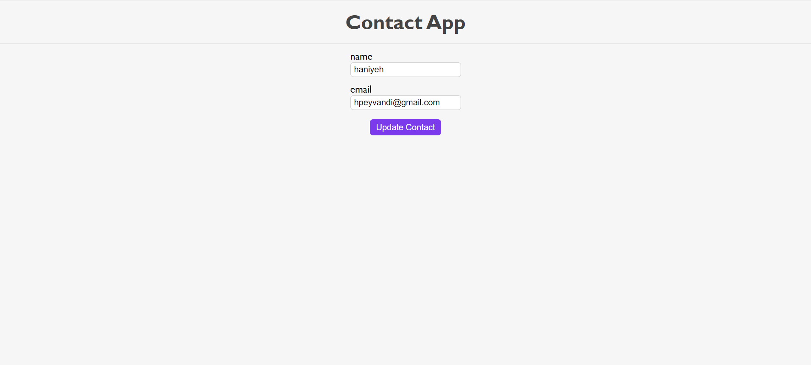
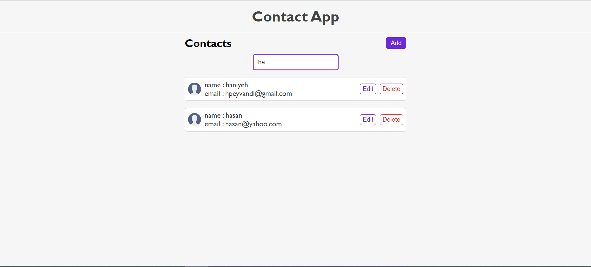

# ContactList_App

This project is a contact list app. In this app, the user can add some contacts, delete or edit them. The user can search contacts by name or email.

## Technologies

- HTML5
- CSS3
- React.js

## Screenshots

## Getting Started with Create React App

This project was bootstrapped with [Create React App](https://github.com/facebook/create-react-app).

## Available Scripts

In the project directory, you can run:

### `npm install`

Installs the packages needed in this project.

### `npm start`

Runs the app in the development mode.\
Open [http://localhost:3000](http://localhost:3000) to view it in your browser.

The page will reload when you make changes.\
You may also see any lint errors in the console.

